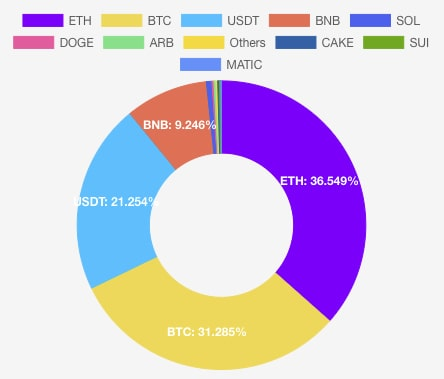

### Hi there, I'm DomChan - aka [domechn][website] 👋

## I'm a Developer, and ETH Believer!!

- 🏖 Waiting for vacation
- 💴 Buying more eth

### Languages and Tools:

 
 

---

### 📕 Latest Blog Posts

<!-- BLOG-POST-LIST:START -->
- [Go Monorepo 依赖管理最佳实践](https://domc.me/2026/01/21/go_monorepo_optimization/)
- [ArgoCD Monorepo 性能优化之路（二）](https://domc.me/2024/09/02/argocd_mono_repo_performance_optimization_second/)
- [ArgoCD Monorepo 性能优化之路](https://domc.me/2024/08/03/argocd_mono_repo_performance_optimization/)
- [如何管理我的加密货币资产](https://domc.me/2023/06/30/how_to_manage_crypto_assets/)
- [Cilium 从 0 到 0.1](https://domc.me/2021/10/17/cilium_0_to_0_1/)
<!-- BLOG-POST-LIST:END -->

➡️ [more blog posts...](https://blog.domc.me)

---

    
 ⚡️ Recent GitHub Activity 

<!--START_SECTION:activity-->
1. 🎉 Merged PR [#2](https://github.com/domechn/irsa-controller/pull/2) in [domechn/irsa-controller](https://github.com/domechn/irsa-controller)
2. 🗣 Commented on [#2055](https://github.com/warpdotdev/Warp/issues/2055) in [warpdotdev/Warp](https://github.com/warpdotdev/Warp)
3. 💪 Opened PR [#349](https://github.com/pixie-io/pixie/pull/349) in [pixie-io/pixie](https://github.com/pixie-io/pixie)
4. ❗️ Opened issue [#348](https://github.com/pixie-io/pixie/issues/348) in [pixie-io/pixie](https://github.com/pixie-io/pixie)
5. 🎉 Merged PR [#1](https://github.com/domechn/domechn.github.io/pull/1) in [domechn/domechn.github.io](https://github.com/domechn/domechn.github.io)
<!--END_SECTION:activity-->

    
 ⚡️ GitHub Stats 

[website]: https://blog.domc.me
