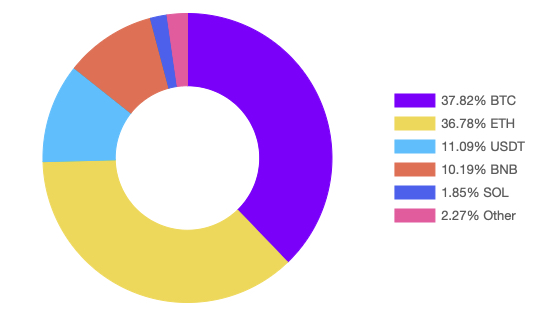

<div align="center">

# 👋 Hi there, I'm DomChan

[](https://git.io/typing-svg)

[](https://domc.me)
[](mailto:domdoumc@gmail.com)
[](https://x.com/truedomchan)

</div>

---

## 🚀 About Me

```typescript
const domechn = {
    code: ["TypeScript", "Go", "Java", "Python"],
    technologies: {
        frontEnd: {
            js: ["React", "Vue", "Node.js"],
            css: ["Tailwind", "Bootstrap"]
        },
        backEnd: {
            java: ["Spring Boot"],
            go: ["Gin", "Echo"],
            misc: ["Docker", "Kubernetes", "ArgoCD"]
        },
        databases: ["MongoDB", "MySQL", "Redis", "PostgreSQL"],
        cloud: ["AWS", "GCP", "Kubernetes"],
    },
    currentFocus: "Building awesome crypto portfolio tracking tools 📊",
    funFacts: ["🏖 Waiting for vacation", "💎 Buying more ETH", "☕️ Powered by coffee"]
};
```

---

## 💼 Featured Project

<div align="center">

### 📊 [Track3 - Crypto Portfolio Tracker](https://github.com/domechn/track3)

<a href="https://github.com/domechn/track3">
  
</a>

*Track your crypto assets with style! 🚀*

[](https://github.com/domechn/track3)
[](https://github.com/domechn/track3)

</div>

---

## 🛠️ Tech Stack

<div align="center">

### Languages


### Frontend


### Backend & DevOps


### Databases


### Tools


</div>

---

## 📊 GitHub Stats

<div align="center">
  
  
</div>

<div align="center">
  
</div>

<div align="center">
  
</div>

---

## 📝 Latest Blog Posts

<div align="center">

<!-- BLOG-POST-LIST:START -->
- 📘 [Best Practices for Go Monorepo Dependency Management](https://domc.me/en/posts/go-monorepo-best-practices.html)
- 📙 [Go Monorepo 依赖管理最佳实践](https://domc.me/zh/posts/go-monorepo-best-practices.html)
- 📗 [ArgoCD Monorepo Performance Optimization Journey &lpar;Part 2&rpar;](https://domc.me/en/posts/argocd-monorepo-performance-optimization-2.html)
- 📕 [ArgoCD Monorepo 性能优化之路（二）](https://domc.me/zh/posts/argocd-monorepo-performance-optimization-2.html)
- 📔 [ArgoCD Monorepo Performance Optimization Journey](https://domc.me/en/posts/argocd-monorepo-performance-optimization.html)
<!-- BLOG-POST-LIST:END -->

**[➡️ Read More Posts](https://blog.domc.me)**

</div>

---

## 🔥 Recent GitHub Activity

<details>
  <summary>📈 Click to expand activity</summary>
  <br/>

<!--START_SECTION:activity-->
1. 🎉 Merged PR [#2](https://github.com/domechn/irsa-controller/pull/2) in [domechn/irsa-controller](https://github.com/domechn/irsa-controller)
2. 🗣 Commented on [#2055](https://github.com/warpdotdev/Warp/issues/2055) in [warpdotdev/Warp](https://github.com/warpdotdev/Warp)
3. 💪 Opened PR [#349](https://github.com/pixie-io/pixie/pull/349) in [pixie-io/pixie](https://github.com/pixie-io/pixie)
4. ❗️ Opened issue [#348](https://github.com/pixie-io/pixie/issues/348) in [pixie-io/pixie](https://github.com/pixie-io/pixie)
5. 🎉 Merged PR [#1](https://github.com/domechn/domechn.github.io/pull/1) in [domechn/domechn.github.io](https://github.com/domechn/domechn.github.io)
<!--END_SECTION:activity-->

</details>

---

<div align="center">

### 💬 Connect With Me

[](https://x.com/truedomchan)
[](https://domc.me)
[](mailto:domdoumc@gmail.com)

---

### 👀 Profile Views


---


*"Code is like humor. When you have to explain it, it's bad." – Cory House*

</div>

[website]: https://blog.domc.me
